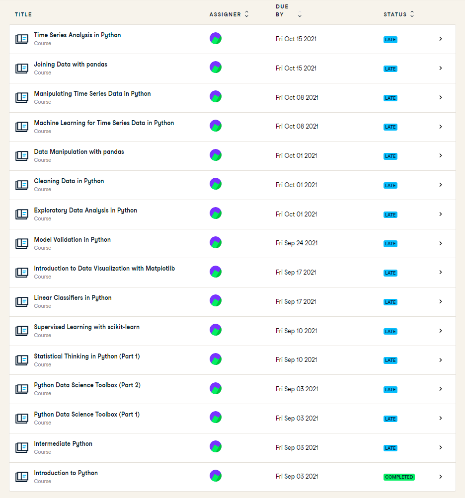

# The Smart Teddy Portfolio - Data Science Minor
By: Breno van Tricht

Studentnummer: 16132041

Project Group Team Emo: 
- Jaap van Gestel 
- Koen de Bruijn 
- Julian Groen 
- Zahir Bholai 
- Yuri Lamijo 

Docenten: Jeroen Vuurens, Tony Andrioli, Ruud Vermeij en Raymond Hoogendoorn

# Introduction
Smart teddy is therapueutic companion  located in the homes of senior citizen. It is used to monitor the quality of life of the elderly within the early stages of dementia. It does this with various sensors which combined with the software in the base station produce reports about the quality of life. Our task is to recognize emotions from audio.
  

# Datacamp Courses

Progress in DataCamp

  
# Reflection and evaluation

### Reflection on own contribution to the project.

### Reflection on own learning objectives.

### Evaluation on the group project as a whole.

  
## Research Project

### Task Definition
The Smart Teddy is a therapeutic companion with a very basic functionality. It can bark and move its tail if someone interacts with it. It is soft and cuddly to invite people to grab and hug it. Seniors can keep the Smart Teddy as a long term companion. Like a real pet, the Smart Teddy observes the senior citizen using its sensors. It has a digital brain that allows it to understand what the senior does during the day and estimates how much the senior citizen is enjoying his/her time. Teddy can also check whether the senior is having enough sleep and how often they wake up during the night. From all this information, Teddy tries to make an educated guess about the QoL of the senior, and inform their family or caregivers about their condition. 

The Smart Teddy project were split into three groups in this minor, one group worked on detecting eating and drinking sounds and another group worked on detecting dialogue in the room. Our research group was assigned to work on the emotions part of this whole project led by dr. Hani Al – Ers. The end goal of our assigned project was to detect and classify emotions the dementia patient was showing. After discussing with our product owner and lectureres we had come up with the following main research question:

Which machine learning models achieve the highest precision classifying emotions, using (two) datasets containing audio with labeled vocal emotional expressions recorded in a professional recording studio, in order to recognize emotions within household environments?

More information about the main research question will be covered in the research proposal sub-chapter.

#### Research proposal
The research proposal was written by myself and project member Breno van Tricht. We have written the research propsal to get a clear view of the research we are going to conduct and it also has been of aid at writing the research paper. The reason that the research main question was chosen, was because the research group were investigating the current methods of classifying emotions from audio data. After investigating these methods the research group make a choice for the best looking model and will train it on the emotion-labelled datasets that we have found. Aiming for the highest precision was chosen because the end use involves mental health regarding dementia which must be handled with care. It's unacceptable to have a lot of false positives because the teddy bear is used as an advisor and the professionals can decide how to respond to this. It is better to be certain of an emotion than to misclassify an emotion. The emotions detected and shown are an indication of how the patient is feeling and if he is capable of living on his own. 
The scope of the research, sub-questions, evaluation method, and related work are also covered in the 
[research proposal](https://docs.google.com/document/d/1NxFVP1G9DyZr4Q7_GdJvULewCiscxtOvygtyHUCDSeE/edit#heading=h.rqlgrsn8oj5p).

#### Notes
Every week the research group had meetings with lectureres and the product owner. New ideas and feedback are some of the many things that are discussed at the meetings. At these meetings I functioned as a note taker to have the topics that are discussed written down so that the research group won't forget it. The [notes](https://docs.google.com/document/d/1xQncillbnLcRF8wKagUnnbbejlcOvx4zWCJvwhQ0PGc/edit#) are here.

### Evaluation

### Conclusions

### Planning

## Predictive Analytics

### Selecting a Model

### Configuring a Model

### Training a model

### Evaluating a model
 
### Visualizing the outcome of a model (explanatory)

## Domain knowledge

### Introduction of the subject field

### Literature research

### Explanation of Terminology, jargon and definitions

## Data preprocessing

### Data exploration
 
### Data cleansing

### Data preparation

### Data explanation

### Data visualization (exploratory)

## Communications

### Presentations

### Writing paper

## List of Notebooks 
