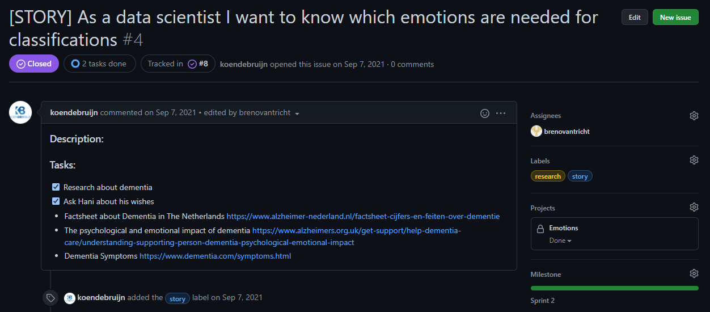

# The Smart Teddy Portfolio - Data Science Minor
By: Breno van Tricht      (16132041)

Studie: Bedrijfskunde

Cursus: Minor Applied Data Science

Project Group Team Emo: 
- Jaap van Gestel 
- Koen de Bruijn 
- Julian Groen 
- Zahir Bholai 
- Yuri Lamijo 
- Breno van Tricht

Docenten: Jeroen Vuurens, Tony Andrioli, Ruud Vermeij en Raymond Hoogendoorn

# Introduction
In dit persoonlijke portfolio wordt besproken wat de bedrijfskunde student heeft bijgedragen aan het project, wat de student geleerd heeft tijdens de minor en reflecteert de student over zijn eigen handelen. 

Team Emo maakt onderdeel uit van het Smart Teddy initiatief gerund door Hani Al-Ers.  

# Datacamp Courses

<details><summary>Progress in DataCamp</summary>


In de eerste week was het haalbaar en goed te doen voor mij om één datacamp course af te ronden, de week daarop werden dat er 4 en dat was net te veel voor mij. Ik had zelf nog nooit geprogammeerd en dit was compleet nieuw voor mij. Hier is toen een kleine achterstand ontstaan waardoor er achter de volgende courses “late” bij staat. Gedurende de minor liep ik gemiddeld anderhalve week achter op de datacamp deadlines.

</details>


# Reflection and evaluation


<details><summary>Reflection on own contribution to the project</summary>


**Situatie**

Begin dit schooljaar ben ik begonnen met de Minor Applied Data Science op de Haagse Hogeschool. Ik had aan het begin veel vertrouwen dat ik veel zal gaan leren tijdens deze minor. Ik koos een minor buiten mijn eigen studierichting en zag dit als een grote uitdaging. 
Het Smart Teddy team waar ik onderdeel van uitmaakte werkte aan emotieherkenning bij ouderen met dementie. Dit werd gedaan met behulp van audio. Dit team bestond grotendeels uit software engineer studenten. Dit project had ik gekozen omdat ik geïnteresseerd ben in psychologie en ik hier graag onderzoek naar wilde doen. Tijdens de minor wilde ik gebruik gaan maken van de kennis en kwaliteiten uit mijn studie bedrijfskunde.   


**Taak**

Doordat ik minder snel op dezelfde golflengte was met de programmeurs over de technische kant, heb ik aangeboden om andere onderzoekstaken op me te nemen. Denk hierbij aan het opstarten van het onderzoek, de richtlijnen vormgeven, het woord nemen bij meetings, onderzoek doen naar het onderwerp/probleem, de research proposal opzetten en het schrijven van de paper. Ook het online contact met bijvoorbeeld de probleemeigenaar Hani werd een van mijn taken. Hani verwachtte op een gegeven moment dat wij bij elke meeting een presentatie hielden. Verder kreeg ik de onderzoekende taak om de emoties te verkennen en te oriënteren welke wij zouden gaan classificeren.


**Actie**


Ik had aan mijn projectgroepje voorgesteld om de presentaties voor Hani op mij te nemen en hier een leidende rol in te spelen. Mochten er dingen niet lekker lopen of verkeerd gaan meldde ik dat bij Hani en hadden hij en ik in het bijzijn van de groep hier discussies over. Er was een andere student die geen programmeur van aard was in mijn groepje, Zahir. Zahir en ik hebben veel onderzoek gerichte taken op ons genomen. Zo hebben wij bijvoorbeeld samen onderzoek gedaan, een research proposal gemaakt en zijn we begonnen aan de research paper. In de research proposal hadden we als eerste voor de evaluatiemethode recall gekozen, omdat dat ons het meest voordehand liggend leek. Achteraf bleek dat niet zo te zijn. Dit onderwerp is vaak met de docenten besproken waarbij ik terugkoppeling heb gekregen van Tony en Jeroen. Daarnaast heb ik ook naar Hani zijn mening gevraagd om zo een compleet beeld te krijgen. Hiernaast heb ik mij als enige gefocust op de ziekte dementie in het algemeen. 

**Resultaat**

Het heeft goed gewerkt om op deze manier te handelen. Ik heb alle presentaties voor Hani mogen doen en heb het contact via Teams met docenten geregeld wanneer er vragen waren.	Ik vond het een fijne rol om aan de onderzoekende kant van het project te zitten. Ik had uiteindelijk ook de ruimte gekregen om mee te kunnen helpen met het programmeren en vond het fijn om ook hier een bijdrage te kunnen leveren. Daarnaast heb ik mij verdiept in de ziekte dementie, dit vond ik erg interessant en dit hielp heel erg bij het vorm geven van het project. Dit was me goed afgegaan en ik vond het een leuke taak. De research proposal is naar alle docenten toegestuurd en was na een aantal puntjes feedback in orde.


**Reflectie**

Door mij te richten op de onderzoekende taken als contributie aan het project, heb ik veel geleerd over onderzoek doen. Zo weet ik nu hoe je een research proposal opstelt, hoe je in online databanken op zoek gaat naar relevante artikelen over een bepaald onderwerp en hoe je een research paper schrijft. Ik ben tevreden over mijn handelingen en ben ook blij dat ik tijdens deze minor vaak heb mogen presenteren. Dit vond ik eerst nog erg spannend. De anderen zijn ook blij geweest dat zij het contact met Hani en de presentaties voor hem los konden laten. Hier heb ik van mijn medestudenten meerdere malen complimenten over gekregen.


</details>


<details><summary>Reflection on own learning objectives</summary>


**Situatie**

Ik had erg veel interesse in programmeren doordat ik een visie van mijn toekomst heb waarin ik graag wil gaan ondernemen en een online start-up wil gaan runnen. Ik vind data erg interessant en hier deed ik al het een en ander mee. Zo heb ik bij mijn vorige stageplek, een online marketingbureau, veel met Google Analytics gespeeld en vond ik dit super interessant. In het marketingbureau waar ik stageliep werd ook gebruik gemaakt van Machine Learning en hier was ik nieuwsgierig naar. Om hier meer over te leren heb ik gekozen voor de Minor Applied Data Science.

**Taak**

In welke sector ik een start-up wil beginnen, weet ik nog niet precies, maar ik weet wel dat ik dit het liefst online doe en daar komt ongetwijfeld programmeren bij kijken. Om hier een handigheidje in te creëren en meer van te begrijpen ben ik de Minor Applied Data Science gaan volgen. Hier komen beide werelden in een, zo wil ik graag meer leren over programmeertalen en dit ook toepassen op real world data. Ik had van een aantal bronnen vernomen dat Python een relatief makkelijke programmeertaal is en ik had als leerdoel gesteld dat ik in ieder geval de basis hiervan kon beheersen. Ik had de verwachting gesteld om tijdens de minor erachter te komen of Data Science en programmeren wat voor mij is. Verder wil ik ook mijn onderzoeksvaardigheden uitbreiden, dit is iets wat in mijn studie vaak aan bod is gekomen alleen heb ik nog nooit mogen ervaren hoe dat is met een technisch vraagstuk. Ik wilde mijn kennis verrijken met de werking van machine learning en de gedachtegang van programmeertalen.  


**Actie**


Om de basis van Python te leren beheersen heb ik gedurende de minor veel aandacht besteed aan de courses van Datacamp. De lectures van Jeroen hebben mij veel geleerd over verschillende modellen en de lectures van Tony over onderzoek doen zijn mij goed bijgebleven. Scrum was voor mij voorafgaand aan de minor onbekend. Met behulp van het bouwen van lego en het gebruik van scrum gedurende de minor, heb ik meer kennis over de toepasbaarheid hiervan.
Hiernaast heb ik ook veel kunnen leren van mijn projectgroepje. Zij stonden altijd klaar wanneer ik een vraag had over een stukje code of wanneer ik vastliep met het onderzoek.

**Resultaat**

De Datacamp courses waren erg interessant en handig in elkaar gezet. Ik vond het heel fijn om hier doorheen te lopen en ik ben een stuk beter gaan begrijpen hoe een computer denkt en handelt. Deze courses gecombineerd met de klassikale lessen werkte erg goed om de niet-programmeurs zoals ik bij te spijkeren. Door deze kennis direct toe te passen tijdens ons project en de hackathon heb ik het gevoel gekregen dat ik de basis van Python onder de knie heb.

**Reflectie**

Ik vind dat ik het goed heb gedaan en ben tevreden met de geboekte resultaten tijdens de minor. Door de meetings met Tony heb ik veel geleerd over het onderzoek doen in de technische sector. De gesprekken met Tony heb ik altijd heel prettig ervaren en ik vond het fijn om samen te sparren over ideeën. Deze manier van kritisch denken neem ik mee en kan ik gaan toepassen op andere situaties. Daarnaast heb ik geleerd dat ik programmeren en/of machine learning super interessant vind, maar dat dit toch niet helemaal voor mij is weggelegd. Ik ben blij dat ik deze kennis heb opgedaan en dat ik heb mogen ervaren hoe het is om onderzoek te doen naar een technisch vraagstuk.

</details>


<details><summary>Evaluating on the group project as a whole</summary>

**Situatie**

Tijdens de Minor Applied Data Science maakte ik deel uit van Team Emo. Team Emo bestaat uit een groep van 6 studenten. 4 van de 6 studenten studeren ICT en hebben als richting Software Engineering gekozen, 1 student studeert Bestuurskunde en als laatste studeer ikzelf Bedrijfskunde. Verschillende studies betekent verschillende kennis en invalshoeken. Iedereen studeert op de Haagse Hogeschool, waardoor wij ook wel herkend worden als het groepje waar de docent Nederlands mee kan praten tijdens meetings.

**Taak** 

Toen wij elkaar ontmoetten tijdens de kick-off, bleek het dat de programmeurs elkaar onderling al kenden. 3 van de 6 kenden elkaar van vorige projecten. Dit was erg fijn en zorgde ervoor dat er snel een relaxte sfeer was. Ik wist niet meteen wat mijn rol was in de groep en ik wist ook niet wat er van mij verwacht ging worden. Ook wist ik niet zo goed wat ik van mijzelf moest verwachten. Op dag 1 probeerde ik een beetje de leidende rol te nemen. 

**Actie** 

Wij wilden meteen op de eerste dag een taakverdeling, rolverdeling en afspraken maken over hoe we alles zouden gaan doen tijdens de minor. Ook wilden wij de meetings met docenten meteen plannen zodat wij goed van start konden gaan. Jaap heeft toen, met zijn docenten privilege, lokalen gereserveerd voor de meetings met docenten. Yuri is onze scrum master geworden. Wij hebben gedurende de minor gewerkt met sprints van 2 weken. De taken werden onderling per sprint verdeeld. Het contact werd geregeld via een Discord server die werd aangemaakt. Hierop vond elke dag de daily stand-up plaats en hielden wij elkaar op de hoogte over de status van het project en bijbehorende taken. Op de dagen dat wij fysiek aanwezig moesten zijn voor een college of meeting, werkten wij samen aan het project op school. Op de andere dagen deden wij dit vanuit huis.

**Resultaat** 

Ik vond het in het begin lastig om een rol te vinden die bij mij pastte tijdens het project. Ik had namelijk geen kennis over scrum en wist helemaal niks van programmeren af. Het merendeel van mijn groepje bestond uit programmeurs en hadden wel ervaring met scrum. Hierdoor moest ik soms terug te vallen op de kennis van mijn projectleden. Yuri is de gehele minor onze scrum master geweest. Er kwam al snel naar voren dat Jaap de leiding nam.

**Reflectie**

Het project en de samenwerking tussen de studenten verliep erg soepel. Ik had graag de leiding willen nemen tijdens het project, maar dat bleek erg lastig. Gelukkig nam Jaap snel de leiding, dit was erg fijn en ik ben hem hier dankbaar voor. Ik was blij toen ik hoorde dat een andere student in mijn groepje niet weet hoe programmeren te werk gaat. Tijdens de minor heb ik mij veel gericht op het onderzoeksaspect en heb ik in mindere mate een bijdrage kunnen leveren bij het programmeren aan het project. Het was prettig om op de Discord server met elkaar contact te leggen over het project en ik ben van mening dat iedereen gemotiveerd was. Toch mistte ik ergens het persoonlijk contact tijdens het project. Dit ben ik namelijk gewend uit mijn vorige projectgroepen tijdens de studie Bedrijfskunde. Op de studie Bedrijfskunde zitten veel extraverte studenten waar ik als introvert sneller bevriend mee raak. We waren allemaal erg gefocust op het project waardoor er weinig tijd over was om ook persoonlijk contact te maken. Dit deed niet af aan de resultaten.


</details>


# Research Project
<details><summary> Task Definition</summary>

**Context**

Smart teddy is een therapeutisch compagnon die geplaatst zal gaan worden bij senioren thuis. Deze senioren zitten in de beginnende fase van dementie. Dementie is een verzamelnaam voor ruim vijftig ziektes, de meest voorkomende vorm is Alzheimer. Dementie is een ingewikkelde en ingrijpende ziekte die veel vragen oproept. 
De Smart Teddy zal gebruikt gaan worden om de quality of life (QoL) te monitoren bij senioren in de beginnende fase van dementie. Dit zal gedaan worden door een aantal sensoren en een hiervan is een microfoon die audio zal opnemen. Gecombineerd met de software in de base station zal dit rapporten produceren over de qualite of life. 

In de minor zijn er meerdere groepen bezig met dit vraagstuk. Zo bestaat er ook het team Nourishment, zij houden zich bezig met de eet/drink geluiden van de senior. Ook is er een team dat zich verdiept in de dialogen die gevoerd worden door de senior, dat is team Dialogue. 

Ik maak onderdeel uit van Team Emo, wij hebben ons bezig gehouden met het detecteren van emoties uit audio. Het detecteren van emoties kan voor veel voordelen zorgen. Dementerende ouderen tonen vaak minder emoties wanneer zij zich in een later stadium van dementie bevinden. In het begin van de ziekte tonen de senioren vaak boze emoties. Dit komt doordat ze meestal niet meteen kunnen accepteren of beseffen wat er met ze aan de hand is.

Door bij te houden hoe vaak bepaalde emoties getoond worden, kan de patient beter gemonitord worden. Deze informatie geeft indicaties over de quality of life. Verzorgers en andere health experts kunnen zo beter overzicht houden over hoe het met de senioren gaat.

**Hoofdvraag**

Ik heb veel gewerkt aan het creeren van onze hoofdvraag, na de hoofdvraag te bespreken met alle docenten hebben wij gekozen voor:

> Which machine learning models achieve the highest precision classifying emotions, using datasets containing audio with labelled vocal emotional expressions recorded in a professional recording studio, to recognize emotions within household environments?


Het eerste deel van de hoofdvraag is tot stand gekomen doordat wij gaan onderzoeken welke machine learning model de beste resultaat levert. Het beste resultaat wordt bepaald door de metriek "precision". Hier is veel discussie rondon ontstaan en zal straks meer aan bod komen in het kopje Research Proposal hieronder. 

Het tweede deel van de hoofdvraag slaat op het feit dat wij geen real life data van dementerende ouderen hebben ontvangen. Hierdoor hebben wij er het beste van moeten maken. Dit hebben wij gedaan door gebruik te maken van een gelabelde dataset die ook in andere onderzoeken gebruikt werd.

Het derde deel na de laatste komma is het onderdeel wat wij willen uitbreiden aan bestaand onderzoek. Er is al onderzoek gedaan naar emotieherkenning, maar wij wilden dit beter toepasbaar maken op ons probleem. Zo hebben wij ervoor gekozen om geluiden toe te voegen die je ook in een huishouden tegen zou kunnen komen. Hierdoor bootsen wij de omgeving na waar de teddybear in de toekomst functioneel zal gaan zijn.

**Deelvragen**

>1. Which machine learning algorithms are available in literature to classify emotions from audio? 

>2. Can the known methods of classifying be reproduced with the same precision/recall on the available dataset?

>3. How can precision in machine learning algorithms be improved for the RAVDESS and CREMA-D datasets?

>4. How will balancing the dataset impact the precision of the algorithm?

**Research Proposal**

De research proposal is geschreven door Zahir en ik. In de research proposal staan de onderzoeksvragen waar wij antwoord op willen en de methoden die we daarvoor willen gebruiken.

Hiermee hebben wij een goede basis gelegd voor de start aan de research paper. In de proposal staan alle stapsgewijze veranderingen aan de hoofdvraag genoteerd. Hieronder staat de scope van het project uitgelegd. De hoofdvraag is opgesplitst in deelvragen en de gekozen evaluatiemethode wordt uitgelegd. Ook staat er al een begin aan de related work in voor in de paper, deze is gemaakt door Yuri.

De research proposal kunt u [hier](https://docs.google.com/document/d/1NxFVP1G9DyZr4Q7_GdJvULewCiscxtOvygtyHUCDSeE/edit#heading=h.toqny89ut4bx) vinden.


</details>

<details><summary> Evaluation</summary>

Gedurende de minor was het niet mogelijk om alle experimenten uit te voeren. Hierdoor zijn er nog een aantal dingen die gedaan zouden kunnen worden om ons onderzoek te verbeteren.

**Model trainen met audio van de doelgroep (senioren in beginnende fase van dementie)**

Het model dat wij gemaakt hebben kan met een precision van 84% de emotie herkennen in een stand-out set. Dit is een mooi resultaat, maar hierdoor is het nog onzeker hoe goed het model zou werken op real world data. Wanneer de eerste prototypes van de Smart Teddy bij senioren komen te staan en er daadwerkelijke audio data verzameld wordt zou het model beter getraind kunnen worden. De audio die wij hebben gebruikt is redelijk clean en dat is ook de reden waarom wij achtergrond geluiden hebben toegevoegd om het lastiger te maken.

**Meer datasets toevoegen**

Het onderzoek was in de eerste instantie gedaan met twee datasets, [RAVDESS](https://www.kaggle.com/uwrfkaggler/ravdess-emotional-speech-audio) en [CREMA-D](https://www.kaggle.com/ejlok1/cremad). Toen de datasets [TESS](https://www.kaggle.com/ejlok1/toronto-emotional-speech-set-tess) en [SAVEE](https://www.kaggle.com/barelydedicated/savee-database) werden toegevoegd werd de precisie verhoogd. Er zou gekeken kunnen worden naar het toevoegen van meer soortgelijke audio datasets met gelabelde emoties. In "future work" van de [research paper](Files/Research_Paper_Emotions.pdf) zijn er een paar dataset kandidaten genoemd: eNTERFACE, EMO-DB, DES en SUSAS.

**Toevoegen of weg laten van emoties**

Er zou nog gekeken kunnen worden naar de geclassificeerde emoties. Op dit moment hebben we het model getraind 4 gekozen emoties. Dit is gedaan omdat dit de beste resultaat opleverde met de gekozen parameters. Het is ook mogelijk om met een verzorger of medisch professional te kijken naar relevante emoties van dementerende ouderen. De parameters learning rate en batch size zouden getuned kunnen worden.


</details>

<details><summary> Conclusions </summary>

Om de hoofdvraag te kunnen beantwoorden hebben wij veel verschillende modellen gebruikt om te achterhalen welk het beste presteert. Hiervoor hebben wij als eerst KNN, MLP, Logistical Regression en SVM gebruikt. Ieder projectlid had zijn eigen model gekregen om aan te sleutelen. Zo heb ik de KNN mogen maken. Hier kwam uit dat SVM en KNN het beste presteren. Echter scoort de KNN 100% op de training accuracy en is dus aan het overfitten. De resultaten per emotie en augmentatietype zijn terug te vinden in deze [Spreadsheet](https://docs.google.com/spreadsheets/d/1wc8sp6qxJ8SR_4TogPoZNkbWzzibx6kIHkYBRkAg0OI/edit#gid=995783680)

Uit onderzoek kwam al snel naar voren dat CNN een veelgebruikte methode was voor ons probleem. Hier zijn wij op gaan focussen na het uitproberen van de hiervoor genoemde modellen. Het voorgestelde CNN model in de [paper](Files/Research_Paper_Emotions.pdf) kan de emoties: happy, angry, neutral en sad exclusief huishoudelijke geluiden detecteren met een precision van 84%. Inclusief huishoudelijke achtergrond geluiden kwam er een precision van 80% uit. Deze resultaten laat zien dat, zoals verwacht, achtergrond geluiden toevoegen een negatieve impact heeft op de precision. Deze achtergrond geluiden zijn kunstmatig toegevoegd en zouden wellicht niet representeerbaar zijn voor de geluiden die je tegen zou kunnen komen in bijvoorbeeld de woonkamer van een senior. 

Uit ons onderzoek valt te concluderen dat emoties herkennen met een CNN functioneert. Hier kan nuttige informatie uit gehaald worden voor de quality of life. Denk bijvoorbeeld aan schommelingen in emoties of aanhoudende negatieve emoties. Hiermee kan een verzorger bepalen of er ingegrepen moet worden bij een senior en/of hij/zij nog in staat is om alleen te wonen.


</details>

<details><summary>  Planning</summary>

Team Emo had ervoor gekozen om de Agile Scrum-methode te hanteren. Meer dan de helft was hier bekend mee en vond dit een fijne methode om mee te werken. Voor mij was dit echter nieuw. Ik heb hier veel over geleerd tijdens de workshop van Tony. Wij hadden besloten om een vaste scrummaster aan te wijzen en Yuri kreeg deze rol.

---

<details><summary> Scrumboard- Github</summary>

Voor de sprintplanning maakten wij gebruik van Github. Deze repository is vormgegeven door Koen. Wij werkten eerst met sprints van één week. Na een aantal sprints hebben wij dat veranderd naar sprints van 2 weken. Dit vonden wij beter aansluiten bij de taken en de weekplanning qua meetings, presentaties en colleges. Elke sprint werden de taken vertaald naar user stories door de scrummaster Yuri. Vervolgens werden de user stories verdeeld over de projectleden. Zo had iedereen overzicht over wat er gedaan moest worden en hadden we inzicht wat door wie werd gedaan tijdens de sprint.

Hieronder is weergeven hoe we ons board vorm hebben gegeven. In de linkerkolom "To-do", in het midden "In progress" en "Waiting for feedback" en in de rechterkolom "Done".


Hieronder volgt een overzicht van alle user stories waaraan ik heb gewerkt:


</details>

---

<details><summary> Roadmap - Miro</summary>

In de eerste paar weken vonden wij het erg lastig om het overzicht te houden over alle werkzaamheden die verricht moesten worden om de minor succesvol af te ronden. Hiervoor hadden we toen gezamenlijk een roadmap van gemaakt. De roadmap is heel het project als rode draad gebruikt om te bepalen welke user stories er gemaakt moesten worden en wat de opeenvolgende taken zullen gaan zijn.


</details>

---

<details><summary> Daily Standup - Discord</summary>

Dagelijks hadden wij een Daily Standup. Deze werd op de maandag en woensdag fysiek gehouden omdat dat de dagen waren dat wij op school aanwezig waren. De overige 3 weekdagen werd de standup via Discord gehouden. Tijdens de standup bespraken wij per persoon wat diegene gister gedaan had en wat diegene vandaag van plan is om te gaan uitvoeren. Ook was er ruimte om te delen waar je tegen aan liep en werd er besproken hoe dat opgelost zou kunnen worden.   

</details>

---

<details><summary> Retrospective - Fraankly</summary>

De retrospective werd eenmaal in de 2 weken gehouden aan het eind van de sprint. Deze vond plaats met behulp van de website Fraankly. Hierin konden we aangeven wat we vonden dat er goed ging, wat er minder goed ging en wat we zouden willen veranderen. Vervolgens kon je stemmen op de kaarten die jij het belangrijkst vond en werden er actiepunten uit opgesteld. Hieronder is een voorbeeld te zien van hoe een retrospective erbij ons uitzag. Op onze [Github](https://github.com/koendebruijn/Emotions/wiki/Retrospective) zijn de overige retrospectives te vinden.


</details>

---

<details><summary> Refinement - Discord</summary>

Halverwege de sprint werd er een refinement gehouden op Discord. Tijdens de refinement werd de scrumboard gestreamd. Zo kon iedereen mee kijken hoe het gaat met de gemaakte user stories. In deze meeting keken we naar de stand van zaken en werd ingeschat of het haalbaar was om de geplande taken af te ronden. Naast de scrumboard op Github werd er ook gekeken naar de Roadmap op Miro.

</details>


</details>


# Predictive Analysis

<details><summary>Selecting a Model </summary>

Voor ons onderzoek moesten wij een manier vinden om emoties te herkennen uit audio. Wij hebben gebruik gemaakt van: MLP, Logistic Regression, KNN, SVM en CNN.
Elk projectlid kreeg een taak om een machine learning model op zijn bord te nemen. Ik heb samen met Jaap gewerkt aan een KNN model. De voornaamste reden dat we dit model gekozen hebben is omdat dit toendestijds uitgelegd werd tijdens een college van Jeroen. No Free Lunch Theorem ondersteund deze keuze, we moeten meerdere modellen proberen om te zien wat er het best werkt.  Samen met de kennis uit de colleges, de ervaring met Datacamp en de hulp van een [YouTube Serie](https://www.youtube.com/playlist?list=PLzMcBGfZo4-mP7qA9cagf68V06sko5otr) genaamd Python Machine Learning Tutorial heb ik dit succesvol weten te doen.
 
Uit ons vooronderzoek kwam naar voren dat CNN waarschijnlijk het meest zal gaan opleveren. SVM en Logistic Regression werden ook besproken in een ander onderzoek. Hier volgt later meer over in het kopje Domain Knowledge. 

</details>


<details><summary> Configuring a Model</summary>

Om te achterhalen welke parameters het beste werken heb ik een Grid Search uitgevoerd. Deze grid search heb ik uitgevoerd met behulp van dit [artikel](https://medium.com/@erikgreenj/k-neighbors-classifier-with-gridsearchcv-basics-3c445ddeb657) en de hulp van Jaap. Jaap heeft toen dit model verder uitgewerkt. 

```python

def grid_search(model,x_train, x_test, y_train, y_test):
    #[1,3,5,7,9,11,13,15,17,19]
    n_neighbors = np.arange(1, 25)
    weights = ['uniform', 'distance']
    metric = ['euclidean', 'manhattan']
    param_grid = dict(n_neighbors=n_neighbors, weights=weights, metric=metric)

    clf = GridSearchCV(model, param_grid, cv=5, scoring='accuracy')
    clf.fit(x_train, y_train)

    print("Het model is gefit")
    print("Best parameters set found on development set:")
    print(clf.best_params_)
    print(clf.best_estimator_)
```

Toen Jaap de leiding nam in ons Pair Programming couple zijn we tot het uiteindelijke resultaat gekomen:

```python
class KNN(BaseModel):
    instance="KNN" 

    @classmethod
    def grid_search(self,model,x_train, x_test, y_train, y_test,scoring):
       #[1,3,5,7,9,11,13,15,17,19]
        n_neighbors = np.arange(1, 8)
        weights = ['uniform', 'distance']
        metric = ['euclidean', 'manhattan']
        param_grid = dict(n_neighbors=n_neighbors, weights=weights, metric=metric)
        
        start_time = time.perf_counter()
        clf = GridSearchCV(model, param_grid, cv=5, scoring=scoring, n_jobs=5) 
        end_time = time.perf_counter()
        print(f"Duration Gridsearch: {end_time - start_time:04f}")
        
        start_time = time.perf_counter()
        clf.fit(x_train, y_train)
        end_time = time.perf_counter()
       
        # SAVING MODEL
         print("Saving model")
         dt = datetime.today().strftime('%Y-%m-%d-%H:%M:%S')
         filename = './pkls/'+dt+'-knn.pkl'
         print(filename)
         joblib.dump(clf, filename)
        
        print(f"Duration fitting: {end_time - start_time:04f}")
        print()

        print("Best parameters set found on development set:")
        print(clf.best_params_)
        print(clf.best_estimator_)
        print()

        super().model_accuracy(clf, x_train, x_test, y_train, y_test)
```

</details>


<details><summary> Training a Model</summary>

Onderstaand is het stukje code dat ik heb samen met Jaap heb geschreven om het model te trainen en te achterhalen welke parameters het best zullen gaan presteren.

```python
def model_accuracy(model, X_train, X_test, y_train, y_test):

    # Train accuracy
    y_pred = model.predict(X_train)
    accuracy = accuracy_score(y_train, y_pred)
    print("Train accuracy is: {}".format(accuracy))

    # Test accuracy
    y_pred = model.predict(X_test)
    accuracy = accuracy_score(y_test, y_pred)
    print("Test accuracy is: {}".format(accuracy))

    # Recall & Precision score
    print(f"Recall: {recall_score(y_test, y_pred, average=None)}")
    print(f"Precision: {precision_score(y_test, y_pred, average=None)}")
    print("\n")
    print(classification_report(y_test, y_pred))      

train_model(CREMA_D_JSON_FILE_NAME)
train_model(RAVDESS_JSON_FILE_NAME)
```

Nadat Jaap de leiding nam was dit wat we ervan gemaakt hebben.

```python
    @classmethod
    def train(self, data, scoring="precision_weighted"):

        train = data["train"]
        test = data["test"]

        x_train = np.array(train['features'])
        y_train = np.array(train['emotions'])
        x_test = np.array(test['features'])
        y_test = np.array(test['emotions'])
        
        #GridSearch
        self.grid_search(KNeighborsClassifier(), x_train, x_test, y_train, y_test,scoring)
```

Het trainen van het KNN-model heb ik meerdere keren gedaan met verschillende cross-validation waardes om te kijken wat de gevolgen hiervan zouden zijn. Hieronder is te zien wat het resultaat is van het runnen van de bovenste versie, die gemaakt is door mij. Hier heb ik verder op geëvalueerd.


</details>


<details><summary> Evaluating a Model</summary>

In onderstaande afbeelding is te zien wat de resultaten waren van de verschillende cross validation waardes op het KNN-model. Het valt meteen op dat de training accuracy 100% is bij elke cv-waarde op RAVDESS dataset. Dit betekent dat het model aan het overfitten is. Hieruit is te concluderen dat KNN niet de beste optie is voor het herkennen van emoties uit audio.


Alle machine learning models zijn naast elkaar gelegd om te kijken wat onderling de resultaten waren van onze modellen. Deze zijn [hier](https://docs.google.com/spreadsheets/d/1SGjHORuv2V7R-UGH_zaVUPe-bFol-A4_j-msHxtJBgM/edit#gid=0) te vinden.


</details>


<details><summary> Visualizing the outcome of a Model</summary>

Voor de KNN is verder geen visualisatie opgesteld. Wel heb ik dat voor een ander model gedaan. Ik had een Linear Regression model gemaakt om te spelen met de kennis en vaardigheden die ik had opgedaan. Dit is gedaan op de "Student Performance Data Set" van [UCI](https://archive.ics.uci.edu/ml/datasets/Student+Performance), Center for Machine Learning and Intelligent Systems. 

De Jupyter Notebook voor het model is [hier](https://datascience.hhs.nl:8888/user/16132041/notebooks/Breno/Test%20Models/Linear%20Regression%20Testing/Linear%20Regression%20Training%20Best.ipynb#) te vinden.

Hieronder is de scatter plot te zien die de correlatie toont tussen de Final Grade en de hoeveelheid Failures. Hieraan is af te lezen dat als een student bij andere vakken al eens gefaald heeft, hij/zij lager scoort op de final test "G3". 


</details>


# Domain Knowledge

<details><summary>Introduction of the subject field</summary>


Smart teddy is een therapeutisch compagnon die geplaatst zal gaan worden bij senioren thuis. Deze senioren zitten in de beginnende fase van dementie. Dementie is een verzamelnaam voor ruim vijftig ziektes, de meest voorkomende vorm is Alzheimer. Dementie is een ingewikkelde en ingrijpende ziekte die veel vragen oproept ([source](https://www.alzheimer-nederland.nl/dementie)).  

De Smart Teddy zal gebruikt gaan worden om de quality of life (QoL) te monitoren bij senioren in de beginnende fase van dementie. Dit zal gedaan worden door een aantal sensoren en een hiervan is een microfoon die audio zal opnemen. Gecombineerd met de software in de base station zal dit rapporten produceren over de qualite of life van de senior. 

Ik maak onderdeel uit van Team Emo. Team Emo maakt onderdeel uit van het Smart Teddy initiatief gerund door Hani Al-Ers. Wij hebben ons bezig gehouden met het detecteren van emoties uit audio. Het detecteren van emoties kan voor veel voordelen zorgen. Dementerende ouderen tonen vaak minder emoties wanneer zij zich in een later stadium van dementie bevinden. In het begin van de ziekte tonen de senioren vaak boze emoties. Dit komt doordat ze meestal niet meteen kunnen accepteren of beseffen wat er met ze aan de hand is.

Door bij te houden hoe vaak bepaalde emoties getoond worden, kan de patient beter gemonitord worden. Deze informatie geeft indicaties over de quality of life. Verzorgers en andere health experts kunnen hiermee beter overzicht houden over hoe het met de senioren gaat.

</details>


<details><summary> Literature Search</summary>

Ik heb in het begin veel onderzoek gedaan naar de emoties die geclassificeerd moesten worden. In Sprint 2 om precies te zijn. Hier had ik een bijbehorende user story bij gekregen die hieronder weergeven is. Het was heel interessant om meer over deze ziekte te leren kennen.Achteraf had ik hier te breed naar gekeken en was het niet heel erg bruikbaar voor ons project. Uiteindelijk hebben we het project uit moeten voeren met de datasets die we online gevonden hadden, wat onze keuzes beperkt.



[Factsheet about Dementia in the Netherlands](https://www.alzheimer-nederland.nl/factsheet-cijfers-en-feiten-over-dementie)

[The Psychological and Emotional Impact of Dementia](https://www.alzheimers.org.uk/get-support/help-dementia-care/understanding-supporting-person-dementia-psychological-emotional-impact) 

[Dementia Symptoms](https://www.dementia.com/symptoms.html)

---

Ook hebben we gezamenlijk gezocht naar bestaande methodes voor emotieherkenning uit audio. De papers met een paars vinkje zijn als de belangrijskte soortgelijke onderzoeken ervaren. Deze user story was in eerste instantie niet aan mij toegewezen, ik weet niet meer zo goed waarom. Later kon ik hieraan mee werken om op zoek te gaan. Ik heb toen een Github repo gevonden waarin gebruik werd gemaakt van de database [RAVDESS](https://www.kaggle.com/uwrfkaggler/ravdess-emotional-speech-audio) en [SAVEE](https://www.kaggle.com/barelydedicated/savee-database). RAVDESS was de database waar wij potentie in zagen en verder mee zijn gegaan. Verder werd de repo niet heel goed bekeken door de medestudenten, mij werd toendestijds verteld dat github te praktisch gericht is en ik accepteerde dat het veel te vroeg was hiervoor. Vind het ergens wel jammer dat we hier verder niet meer naar gekeken hebben. De user story hiervoor is hieronder te zien. 


[Github: Speech Emotion Analyzer](https://github.com/MITESHPUTHRANNEU/Speech-Emotion-Analyzer) 

[ieee: A Speech Emotion Recognition Solution-based on Support Vector Machine for Children with Autism Spectrum Disorder to Help Identify Human Emotions](https://ieeexplore.ieee.org/document/9249147)

[ieee: Speech Emotion Detection using IoT based Deep Learning for Health Care](https://ieeexplore.ieee.org/abstract/document/9005638/authors#authors)


</details>


<details><summary> Explanation of Terminology, Jargon and Definitions</summary>

Ambient sounds - Huishoudelijk geluiden, die je tegen zou kunnen komen in een huis

Convolutional Neural  Network  (CNN) - Is een kunstmatig neuraal netwerk, meestal toegepast om visuele beelden te analyseren

Classificatieanalyse - Voorspellen van een label

CREMA-D - Audio dataset van gesproken zinnen waarvan de emoties  gelabeld zijn

Datacamp - Online leeromgeving voor Data Science

Dementie - Is de naam voor een combinatie van symptomen (een syndroom), waarbij de hersenen informatie niet meer goed kunnen verwerken

Emotie - Is een innerlijke beleving of moeilijk te omschrijven gevoel. De vier bekendste emoties noemt men angst, vreugde, boosheid en verdriet. Elk mens toont emoties.

Health Care - de georganiseerde verstrekking van medische zorg aan individuen of een gemeenschap

K-Nearest Neighbor (KNN) - Eenvoudig algoritme dat alle beschikbare cases en nieuwe cases classificeert bij meerderheid van stemmen van K Neighbors

Linear Regression - is een statistisch proces waarmee je een lineair verband tussen twee grootheden kan aantonen

Machine Learning Perceptron (MLP) - is een neuraal netwerk waarin de neuronen in verschillende lagen met elkaar verbonden zijn

Precision - Wordt gebruikt om de prestaties van classificatie- of informatie-ophaalsystemen te evalueren. Is het gedeelte van relevante variabelen tussen alle opgehaalde variabelen.

RAVDESS - Audio dataset van gesproken zinnen waarvan de emoties  gelabeld zijn

Recall - Wordt gebruikt om de prestaties van classificatie- of informatie-ophaalsystemen te evalueren. Recall wordt ook wel gevoeligheid genoemd.

Regressieanalyse - Voorspellen van een hoeveelheid

Research Proposal - Het onderzoeksplan waarin staat wat je wilt gaat doen en hoe je dat wilt gaan doen

SAVEE - Audio dataset van gesproken zinnen waarvan de emoties  gelabeld zijn

Smart Teddy - Het project waar gewerkt wordt aan het ontwikkelen van een teddybear die bij demente ouderen thuis staat die als ondersteuning dient

Speech - Het geheel aan talige klanken die door het menselijk lichaam met behulp van lucht uit de longen en het spraakkanaal worden voortgebracht

Support Vector Machine (SVM) - Supervised learning models met bijbehorende leeralgoritmen die gegevens analyseren voor classificatie en regressieanalyse

TESS - Audio dataset van gesproken zinnen waarvan de emoties  gelabeld zijn

Quality of Life - Verzamelnaam voor de uitkomst van meetinstrumenten bij het kwaliteit-van-leven-onderzoek waarmee men probeert uit te drukken hoe de beleving van de (on)-mogelijkheden van het actuele leven zich verhoudt tot die van het gewenste leven

</details>

# Data Preprocessing

<details><summary>Data</summary>

Tijdens de minor heb ik mij bijna niet bezig gehouden met het preprocessen van de data voor ons model. Ik zal dus ook niet alle punten bespreken van dit hoofdstuk zoals in de scoring rubrics vermeld staat aangezien dit voornamelijk door mijn projectleden gedaan is. Wel heb ik een paar dingetjes gedaan die in dit hoofdstuk passen. 

Tijdens de Hackaton heb ik actief meegedaan en hebben we gezamenlijk de data explored, cleaned en prepared. Een link naar onze Hackaton Notebook is [hier](https://datascience.hhs.nl:8888/user/16132041/notebooks/emo/project/Hackaton.ipynb) te vinden


Samen met Koen heb ik gewerkt aan een Dataset Loader voor de CREMA-D dataset. Koen maakte er een voor de RAVDESS dataset en ik deed dit voor dataset CREMA-D. Deze is toendestijds gebruikt om de datasets in te kunnen laden.

```python
%run ../source/pipeline/dataset_loader.ipynb
import json
class CremadPLoader(Loader):
    
    BASE="../preprocced data/data"
    instance="Crema-d Processed Loader"
    
    @classmethod
    def load_dataset(self, variant):
        dataset = {}
        
        train_path=f"{self.BASE}/train/crema-d/train_{variant}_crema-d_preprocessed_data.json"
        test_path=f"{self.BASE}/test/crema-d/test_{variant}_crema-d_preprocessed_data.json"
        
        with open(train_path) as train_data:
            dataset["train"] = json.load(train_data)
            
        with open(test_path) as test_data:
            dataset["test"] = json.load(test_data)
            
        return dataset
```

Later in het project hebben we dit omgezet tot één gezamenlijke dataset loader. Deze gezamenlijke loader is [hier](https://datascience.hhs.nl:8888/user/16132041/notebooks/emo/source/pipeline/dataset_loader.ipynb) te vinden.

</details>

# Communication

<details><summary> Presentations</summary>

---

Tijdens de minor waren er een aantal presentaties die gedaan moesten worden. De interne presentatie om de week, een presentatie voor Hani om de week, de Learning Lab en de externe presentaties. De presentaties voor Hani heb ik allemaal mogen doen. Bij de overige presentaties was niet van te voren bepaald wie die zou gaan doen. Ik heb mij kandidaat gesteld bij elke presentatie omdat ik daar graag beter in wil worden.

---

De interne presentaties waren voornamelijk gedaan door Jaap. Ik ging altijd mee naar voren voor ondersteuning en heb hier toen ook deel kunnen nemen aan de presentaties. De interne presentaties waar ik heb mee mogen presenteren staan hieronder vermeld. Hier had ik voornamelijk het woord over de Main Research Question, Research Proposal en andere onderzoekende taken:


[Interne Presentatie Week 4](https://docs.google.com/presentation/d/1VBQd9DZl8fIsv-5RBmLyrqp9_HKh1xJwpDcWu_B7I7g/edit#slide=id.gea50fed553_0_6)

[Interne Presentatie Week 6](https://docs.google.com/presentation/d/1HsTYFASqxeT0n3aWm5oJHQKAOU0aH2ChFHOztF_8-wU/edit#slide=id.gedadb8a670_3_0)

[Interne Presentatie Week 10](https://docs.google.com/presentation/d/1N9T62xSTJwfBfDu5KhDCf268zWk33ZWVv752YpY8zSk/edit#slide=id.g100a22f516d_0_82)

[Interne Presentatie Week 10](https://docs.google.com/presentation/d/1N9T62xSTJwfBfDu5KhDCf268zWk33ZWVv752YpY8zSk/edit#slide=id.g100a22f516d_0_82)

*(Als het goed is wordt er bij het openen gelinkt naar de specifieke dia)*

---

In de eerste paar meetings verliep het contact met Hani niet geweldig en waren wij soms ook niet goed genoeg voorbereid om het gesprek of om een discussie aan te gaan met Hani. Hani heeft toen voorgesteld om altijd een presentatie te maken en deze te presenteren. Vanaf presentatie week nummer 11 sloot Jelle bij ons aan. Jelle zit ook in dit vakgebied en was erg geinteresseerd waar wij mee bezig waren. Sinds dat moment heeft hij elke meeting bijgewoond. Alle presentaties voor onze product owner Hani heb ik gepresenteerd.

[Presentatie Hani Week 5](https://docs.google.com/presentation/d/1qrNHJH6cqTATocxjrqoc8u1Mdzrkl-Nj99uRyfylBmo/edit#slide=id.p)

[Presentatie Hani Week 8](https://docs.google.com/presentation/d/1olIzBfWSBZTIDrAKjIqnwSahwACmkKfAEFULk3foffc/edit#slide=id.p)

[Presentatie Hani Week 9](https://docs.google.com/presentation/d/1SUvTwHhTpL_T0HxaoeSOyDgE_OyNTGavJyxcbBUpp6E/edit#slide=id.p)

[Presentatie Hani Week 11](https://docs.google.com/presentation/d/1k2Ly1bdA8k35lY7myMH4tpMTBwY7Z_5OSPq31DkUVSw/edit#slide=id.p)

[Presentatie Hani Week 13](https://docs.google.com/presentation/d/18LSxUXswJbfFbnuHNBjXsbyp76UQy35qI5URQuQtltg/edit#slide=id.p)

[Presentatie Hani Week 15](https://docs.google.com/presentation/d/12v3rGTKVmE1WxA5l0Obaj4xzBKkD9JZS6ShX6yylbAU/edit#slide=id.p)

*Alle dia's zijn door mij gepresenteerd.*

---

Voor de externe presentaties besloten we vaak tijdens het samenstellen van de presentatie wie zou gaan presenteren. Ik vond dit leuk om te doen en heb ook bij elke externe presentatie mogen presenteren. Het verschilde per externe presentatie welke projectleden mee presenteerde.

[Externe Presentatie 1](https://docs.google.com/presentation/d/1s8yLUMx2hhJINx-23QsXn2dgf4osR5rwR3pb1_N6MCw/edit)

[Externe Presentatie 2](https://docs.google.com/presentation/d/1Q8pCSaHh-NOdmONjhDi91h5KIwgagx26fTpmsYayNGw/edit#slide=id.p)

[Externe Presentatie 3](https://docs.google.com/presentation/d/1zTva9BPbiWAARs8vM3S7Wy0qXT1pBUMSoa-8i74HjZQ/edit#slide=id.p)

*Bij externe presentatie 1 en 2 heb ik het kopje "Next Steps" gepresenteerd, bij externe presentatie 3 heb ik de intro gedaan en de "Recap" gepresenteerd.*

---

Ik heb ook de Learning Lab gepresenteerd samen met Zahir, Jaap en Koen. Onze Learning Lab ging over Support Vector Machines (SVM).

[Learning Lab SVM](https://docs.google.com/presentation/d/1NrmkkP36NY3_dqtBgHQRZkpA7xsUlrhc/edit#slide=id.p1)

*De introductie, voor en nadelen van SVM en de hyperparameters heb ik gepresenteerd. Dia 1 t/m 6.*

---

</details>

<details><summary> Writing Paper</summary>

Ik keek erg uit naar het schrijven van de Research Paper. Voordat we begonnen met het schrijven van de paper had ik een layout gemaakt van hoe onze paper ongeveer ingedeeld zou kunnen worden. Deze heb ik toen besproken met mijn projectleden en hier hebben wij van Tony feedback op gekregen. Desbetreffende Research Paper Layout kunt u [hier](https://docs.google.com/document/d/1X60FCTV-oK9eAKS9KQ81hX8ZSgNyez8vGyqV61jhlj8/edit#) vinden. Ik heb hiervoor naar soortgelijke papers gekeken die voor ons van belang waren en hun indeling vergeleken met elkaar. De layout van die papers staan kort vermeld in het document.

Zahir, Yuri en ik zijn tezamen begonnen met het schrijven van de paper. Jaap kwam relatief snel helpen en toen we iets verder waren met de paper waren sloten Julian en Koen aan. Yuri Zahir en ik hebben de introduction en background geschreven.  

De 3e alinea van Background is door mij alleen geschreven. Verder heb ik veel bijgedragen aan de Evaluation Method en is de Conclusion & Discussion door mij geschreven. Nadat elk hoofdstuk ingevuld was hebben wij de koppen bijelkaar gestoken om de puntjes op de i te zetten. We hebben alinea voor alinea alles behandeld en besproken of we het er mee eens waren. Op deze manier werd feedback van projectleden meteen verwerkt.

Voor de layout heb ik gebruik gemaakt van de officiële ieee template, deze heb ik [hier](https://www.ieee.org/conferences/publishing/templates.html) gevonden. 


[De Research Paper](Files/Research_Paper_Emotions.pdf)


</details>
